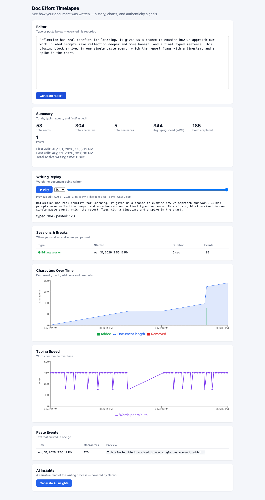

# Doc Effort Timelapse

**See how a document was written — not just what it says.**

A final draft can't tell you whether it was typed over an afternoon or pasted in
five seconds. Doc Effort Timelapse records every edit as it happens and turns
that history into a writing process report: a keystroke-by-keystroke replay,
characters-over-time charts, session/break detection, a timestamped log of every
paste, and an AI-written authenticity assessment. Think **git blame + a
timelapse, for prose**.



## What you get

- **Writing replay** — watch the document build itself, with play/pause, 0.2x–4x
  speed, and per-edit timestamps
- **Characters over time** — document growth plus added/removed chars per
  interval; long idle breaks are compressed on the axis and annotated
  ("38 min pause")
- **Typing speed timeline** — words per minute across the session
- **Sessions & breaks** — when work happened and when it didn't, with real
  dates, times, and durations
- **Paste detection** — every paste logged with timestamp, size, and preview;
  pastes show up as instant spikes in the chart
- **AI insights** — the computed metrics are handed to an LLM
  (Gemini) which writes a narrative: process story, authenticity assessment,
  flagged sections. In testing it correctly identified scripted 400+ WPM
  "typing" as non-human.
- **Persistence** — history is stored in IndexedDB and survives reloads

## How it works

Everything derives from one append-only event log:

```
Editor (CodeMirror 6) ──events──▶ Event log (IndexedDB) ──read──▶ Replay
                                        │
                                        └──read──▶ Analysis (sessions, timeline,
                                                   metrics, blame — pure functions)
                                                      └──▶ Charts, report, AI prompt
```

Each CodeMirror transaction is normalized into an `EditEvent` — position, text
inserted, text removed, timestamp, and *source* (`input`, `paste`, `delete`,
`undo`). The document at any moment is a fold over the log; blame, metrics,
charts, and the AI payload are all pure read-only derivations of it. Genuine
writing looks like thousands of small timestamped events with churn; a
paste-dump looks like one giant event — the log makes the difference visible.

## Running it

```bash
npm install
npm run dev        # app on http://localhost:5173
```

For AI insights, add a Gemini API key and start the insights server in a second
terminal:

```bash
echo 'GEMINI_API_KEY=your-key-here' > .env   # .env is gitignored
npm run insights                             # proxy on :8787
```

Type or paste into the editor, then hit **Generate report**.

## Tests

```bash
npx vitest run        # 90 unit tests (analysis, storage, components)
npx playwright test   # end-to-end: type → persist → reload → report → replay
```

## Stack

TypeScript, React + Vite, CodeMirror 6, Recharts, IndexedDB, Express proxy →
Gemini (`generateContent` REST API), Vitest + Playwright.

## Known limitations

- Single author, single doc for now — opening the same doc in two tabs at once
  can drop events (sequence collision)
- Effort heuristics (idle threshold, score weights) use sensible defaults and
  aren't tuned yet
- The AI narrates evidence; it doesn't render verdicts — treat it as a second
  pair of eyes, not a detector
